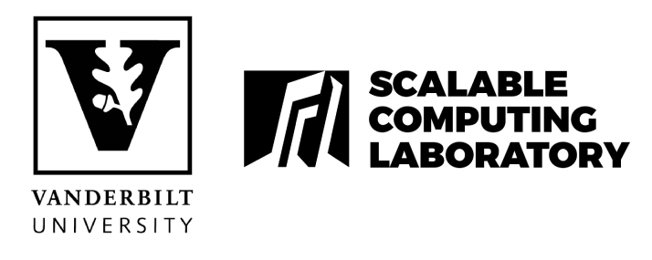

# MPI Lectures 
### CS6320 *Algorithms for parallel computing*
#### 1st and 3rd October 2019

Slides at: Link

&nbsp;

**Table of contents**
---

1. Introduction to MPI
    - Library and implementation characteristics
    - MPI for python
    - Error handling

2. Blocking point-to-point communication
    - Sending and receiving with `MPI_Send` and `MPI_Recv`
    - Dynamic receiving with `MPI_Probe` and `MPI_Status`
    - Groups and communicators
    
3. Non-blocking communication

4. Collective communication
    - Synchronization (Barrier)
    - Data movement (Broadcast, Gather, Scatter, Allgather, Alltoall)
    - Collective computation (Reduce, AllReduce, Scan, Exscan, Reduce_scatter)
    - Define your own collective routine
    - Non-Blocking Collective Operations
    
5. Topology mapping and neighborhood collectives

6. Profiling MPI applications

&nbsp;

**Code examples**
---

1. `hello_world.py`
    - Basic hello world example
2. `rank_hello.py`
    - Hello world for each rank
3. `communicator_split.py`
    - Splitting the processes in two groups based on their ranks (keeping the order of their original ranks)
4. Blocking send examples
    - `send_dict.py` - simple blocking send of a dictionary
    - `send_np_array.py` - simple example of sending a numpy array
    - `send_dtype.py` - example of sending a custom datatype (tuple of int32, double64)
5. `ping_pong.py` 
    - Simple non-blocking communication example
6. `sendrecv.py` 
    - Example of using the sendrecv routine
7. `barrier.py` 
    - Simple barrier example
8. `custom_collective{_np}.py`
    - Two examples of implementing a custom reduce operation
        - Computing the product of Complex numbers (one per each MPI process) - Complex class defined in `Complex.py`
        - Identifying the array indexes containing odd numbers in at least one process (all processes contining a numpy array of the same size)
9. `wtime.py`
    - Time measurement for mpi processes
10. Cartesian topology examples `cart_{topology, shift}.py`
    - Two examples for creating a cartesian topology and identifying the neighbor processes
